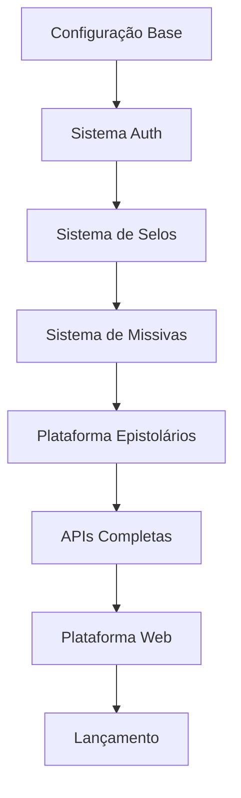

# 🗺️ Roadmap - Epístola

Este documento apresenta o cronograma de desenvolvimento do projeto Epístola com dependências e marcos temporais.

## 📅 Timeline Geral

```
2024-2025: Desenvolvimento Core
├── Q1 2024: Fundação e Auth (v0.1.0 - v0.2.0)
├── Q2 2024: Sistema de Selos e Missivas (v0.3.0 - v0.4.0)
├── Q3 2024: Plataforma de Epistolários (v0.5.0)
├── Q4 2024: APIs e Plataforma Web (v0.6.0 - v0.7.0)
└── Q1 2025: Otimização e Lançamento (v0.8.0 - v1.0.0)
```

## 🎯 Fases de Desenvolvimento

### 📦 Fase 1: Fundação (Meses 1-3)
**Período**: Janeiro - Março 2024  
**Objetivo**: Estabelecer base sólida do projeto

#### Milestones:
- ✅ **v0.1.0 - Fundação** (Mês 1-2)
  - Configuração do projeto
  - Sistema de auth básico
  - Pipeline CI/CD
  - Documentação inicial

- ✅ **v0.2.0 - Auth Completo** (Mês 3)
  - Fluxo OAuth para Epistolários
  - Painel de gestão de aplicações
  - Sistema de permissões

#### Dependências:
- Escolha do stack tecnológico
- Setup da infraestrutura inicial
- Definição da arquitetura de dados

---

### 💰 Fase 2: Sistema Monetário (Meses 4-6)
**Período**: Abril - Junho 2024  
**Objetivo**: Implementar economia interna

#### Milestones:
- 🔄 **v0.3.0 - Sistema de Selos** (Mês 4-5)
  - Carteira digital
  - Sistema de transações
  - Gateway de pagamento

- 🔄 **v0.4.0 - Sistema de Missivas** (Mês 6)
  - Modelo de dados das cartas
  - Inventário de usuários
  - Transferências de propriedade

#### Dependências:
- Integração com gateway de pagamento (Stripe/PayPal)
- Definição da economia do jogo
- Compliance financeiro

---

### 🏪 Fase 3: Marketplace (Meses 7-9)
**Período**: Julho - Setembro 2024  
**Objetivo**: Plataforma para criadores

#### Milestones:
- 🔄 **v0.5.0 - Plataforma de Epistolários** (Mês 7-9)
  - Sistema de criação de Epistolários
  - Loja virtual
  - Sistema de comissões

#### Dependências:
- Sistema de Selos funcionando
- Interface de usuário definida
- Processo de moderação estabelecido

---

### 🔗 Fase 4: Integração (Meses 10-12)
**Período**: Outubro - Dezembro 2024  
**Objetivo**: APIs robustas e plataforma web

#### Milestones:
- 🔄 **v0.6.0 - APIs e Integrações** (Mês 10-11)
  - APIs RESTful completas
  - SDKs para desenvolvedores
  - Sistema de webhooks

- 🔄 **v0.7.0 - Plataforma Web** (Mês 12)
  - Portal principal
  - Dashboard de usuários
  - Marketplace web

#### Dependências:
- Documentação completa das APIs
- Testes de integração extensivos
- Interface web responsiva

---

### 🚀 Fase 5: Lançamento (Meses 13-15)
**Período**: Janeiro - Março 2025  
**Objetivo**: Otimização e lançamento público

#### Milestones:
- 🔄 **v0.8.0 - Expansão e Otimização** (Mês 13)
  - Performance e escalabilidade
  - Monitoramento avançado
  - Backup e recuperação

- 🔄 **v0.9.0 - Recursos Avançados** (Mês 14)
  - Sistema de raridade
  - Analytics para criadores
  - Gamificação

- 🔄 **v1.0.0 - Lançamento Público** (Mês 15)
  - Auditoria de segurança
  - Documentação final
  - Marketing e lançamento

#### Dependências:
- Testes de carga extensivos
- Auditoria de segurança completa
- Materiais de marketing prontos

---

## 🔄 Dependências Críticas

### Técnicas


### Negócio
- **Compliance Financeiro**: Necessário antes do Sistema de Selos
- **Parcerias de Pagamento**: Integração com gateways
- **Marco Regulatório**: Adequação à LGPD/GDPR
- **Estratégia de Marketing**: Preparação para lançamento

---

## 📊 Marcos de Validação

### Desenvolvimento
- **Mês 3**: Primeiro usuário autenticado via OAuth
- **Mês 6**: Primeira transação de Selo processada
- **Mês 9**: Primeiro Epistolário criado e funcionando
- **Mês 12**: Primeiro MVP público disponível
- **Mês 15**: Lançamento oficial

### Métricas de Sucesso
- **Fase 1**: 100% uptime do sistema de auth
- **Fase 2**: Processamento de 1k+ transações/dia
- **Fase 3**: 10+ Epistolários ativos
- **Fase 4**: 1k+ usuários registrados
- **Fase 5**: 10k+ usuários no primeiro mês

---

## 🚧 Riscos e Mitigações

### Riscos Técnicos
| Risco | Probabilidade | Impacto | Mitigação |
|-------|---------------|---------|-----------|
| Problemas de escalabilidade | Média | Alto | Testes de carga desde v0.3.0 |
| Segurança de transações | Baixa | Crítico | Auditoria contínua |
| Integração com gateways | Média | Alto | Múltiplas opções de gateway |

### Riscos de Negócio
| Risco | Probabilidade | Impacto | Mitigação |
|-------|---------------|---------|-----------|
| Mudanças regulatórias | Média | Alto | Acompanhamento jurídico |
| Concorrência | Alta | Médio | Diferenciação por qualidade |
| Adoção lenta | Média | Alto | Marketing e parcerias |

---

## 🎯 Critérios de Go/No-Go

### Para Fase 2 (Sistema de Selos)
- ✅ Sistema de auth estável (99.9% uptime)
- ✅ Testes de segurança aprovados
- ✅ Compliance legal verificado

### Para Fase 3 (Marketplace)
- ✅ Transações funcionando sem falhas
- ✅ Sistema de inventário testado
- ✅ Interface de usuário aprovada

### Para Lançamento (v1.0.0)
- ✅ Auditoria de segurança completa
- ✅ Testes de carga aprovados (10k+ usuários)
- ✅ Documentação 100% completa
- ✅ Suporte ao cliente estruturado

---

## 📈 Métricas de Acompanhamento

### Desenvolvimento
- **Velocity**: Story points por sprint
- **Quality**: Cobertura de testes > 80%
- **Performance**: APIs < 200ms de resposta
- **Bugs**: < 5 bugs críticos por release

### Produto
- **Usuários**: Crescimento mensal de registros
- **Engagement**: Tempo médio na plataforma
- **Transações**: Volume de Selos movimentado
- **Criadores**: Número de Epistolários ativos

---

## 🔄 Processo de Revisão

### Semanal
- Standup de progresso com equipe
- Revisão de métricas de desenvolvimento
- Identificação de bloqueadores

### Mensal
- Revisão de milestones
- Ajuste de cronograma se necessário
- Retrospectiva e lições aprendidas

### Por Fase
- Demo completa da funcionalidade
- Validação com stakeholders
- Aprovação para próxima fase

---

## 📞 Stakeholders e Comunicação

### Equipe Técnica
- **Weekly**: Progresso técnico
- **Bi-weekly**: Revisão de arquitetura
- **Monthly**: Planejamento de sprint

### Gestão
- **Weekly**: Status report
- **Monthly**: Revisão de roadmap
- **Quarterly**: Resultados e ajustes

### Comunidade
- **Monthly**: Update público no blog
- **Quarterly**: Release notes detalhadas
- **On Release**: Comunicação de lançamento

---

*Roadmap atualizado mensalmente com base no progresso real do projeto*