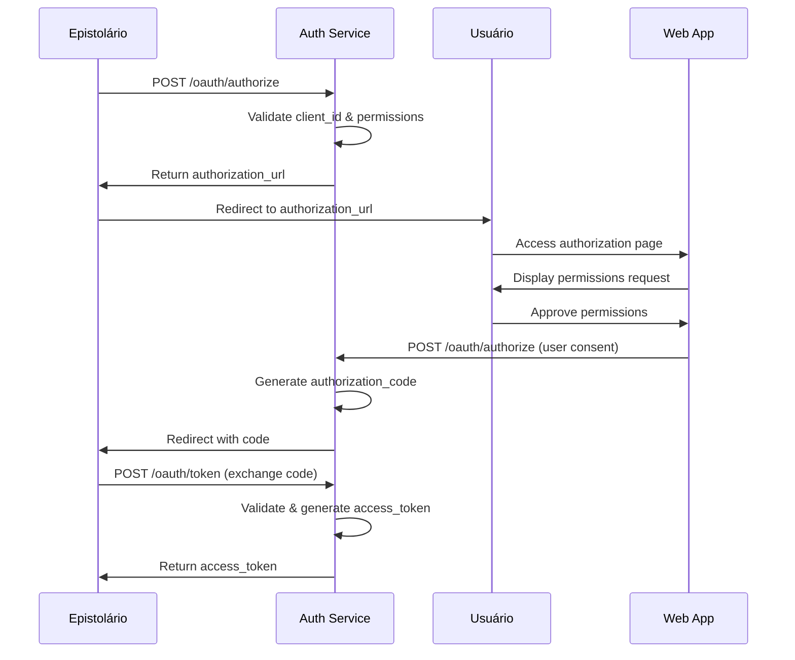
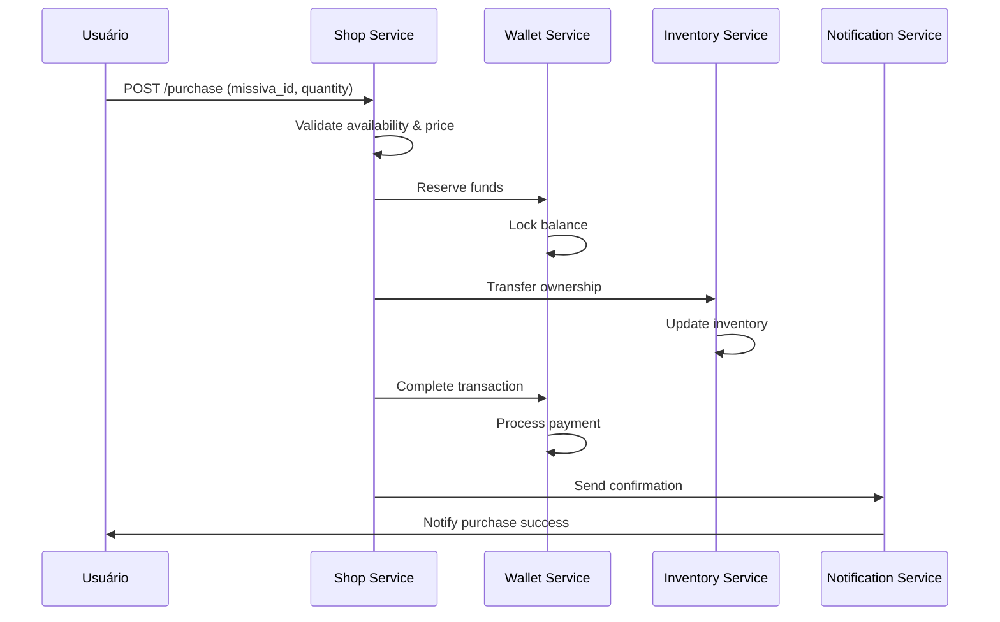

# 🏗️ Arquitetura do Sistema - Epístola

Este documento descreve a arquitetura técnica do sistema Epístola, incluindo componentes, tecnologias e padrões de design.

## 🎯 Visão Geral

A Epístola é construída como uma arquitetura de microserviços modulares que permite escalabilidade e manutenibilidade. O sistema é composto por:

- **Core API**: Serviços fundamentais (auth, usuários, transações)
- **Business Logic**: Serviços de domínio (missivas, epistolários)
- **Integration Layer**: APIs externas e webhooks
- **Web Platform**: Interface web para usuários
- **Admin Dashboard**: Painel administrativo

## 🏛️ Arquitetura Geral

```
┌─────────────────────────────────────────────────────────────┐
│                    Frontend Layer                           │
├─────────────────┬─────────────────┬─────────────────────────┤
│   Web Platform  │  Admin Panel    │   External Apps         │
│   (React/Next)  │  (React/Next)   │   (Epistolários)        │
└─────────────────┴─────────────────┴─────────────────────────┘
                           │
┌─────────────────────────────────────────────────────────────┐
│                    API Gateway                              │
├─────────────────────────────────────────────────────────────┤
│  • Rate Limiting  • Authentication  • Load Balancing        │
│  • Request Routing  • Response Caching  • API Versioning   │
└─────────────────────────────────────────────────────────────┘
                           │
┌─────────────────────────────────────────────────────────────┐
│                 Microservices Layer                         │
├──────────────┬──────────────┬──────────────┬───────────────┤
│ Auth Service │ User Service │ Selo Service │ Carta Service │
├──────────────┼──────────────┼──────────────┼───────────────┤
│ Shop Service │ Analytics    │ Notification │ File Service  │
└──────────────┴──────────────┴──────────────┴───────────────┘
                           │
┌─────────────────────────────────────────────────────────────┐
│                  Data Layer                                 │
├─────────────────┬─────────────────┬─────────────────────────┤
│   PostgreSQL    │     Redis       │    Object Storage       │
│  (Primary DB)   │   (Cache/Sessions) │    (Images/Files)    │
└─────────────────┴─────────────────┴─────────────────────────┘
```

## 🧩 Componentes Principais

### 1. 🔐 Auth Service
**Responsabilidade**: Autenticação e autorização

**Funcionalidades**:
- Registro e login de usuários
- JWT token management
- OAuth flow para Epistolários
- Session management
- Password recovery

**Tecnologias**:
- Node.js + Express/Fastify
- bcrypt para hash de senhas
- jsonwebtoken para JWT
- Redis para session storage

### 2. 👤 User Service
**Responsabilidade**: Gestão de perfis e preferências

**Funcionalidades**:
- CRUD de usuários
- Perfis públicos
- Configurações de conta
- Sistema de notificações
- Histórico de atividades

### 3. 💰 Selo Service
**Responsabilidade**: Moeda digital e transações

**Funcionalidades**:
- Carteira digital
- Transações de Selos
- Histórico financeiro
- Integração com gateways de pagamento
- Prevenção de fraude

**Padrões**:
- Event Sourcing para auditoria
- Saga pattern para transações distribuídas
- CQRS para separar leitura/escrita

### 4. 📜 Carta Service (Missivas)
**Responsabilidade**: Gestão de cartas digitais

**Funcionalidades**:
- CRUD de missivas
- Sistema de inventário
- Transferência de propriedade
- Metadados e atributos
- Sistema de raridade

### 5. 🏪 Shop Service (Epistolários)
**Responsabilidade**: Lojas e marketplace

**Funcionalidades**:
- Gestão de Epistolários
- Catálogo de produtos
- Carrinho de compras
- Sistema de comissões
- Analytics de vendas

## 🗄️ Modelo de Dados

### Core Entities

```sql
-- Usuários
users (
  id SERIAL PRIMARY KEY,
  email VARCHAR UNIQUE NOT NULL,
  username VARCHAR UNIQUE NOT NULL,
  password_hash VARCHAR NOT NULL,
  email_verified BOOLEAN DEFAULT FALSE,
  created_at TIMESTAMP DEFAULT NOW(),
  updated_at TIMESTAMP DEFAULT NOW()
);

-- Epistolários (Aplicações Externas)
epistolarios (
  id SERIAL PRIMARY KEY,
  name VARCHAR NOT NULL,
  description TEXT,
  owner_id INTEGER REFERENCES users(id),
  client_id VARCHAR UNIQUE NOT NULL,
  client_secret VARCHAR NOT NULL,
  redirect_uris TEXT[],
  permissions TEXT[],
  active BOOLEAN DEFAULT TRUE,
  created_at TIMESTAMP DEFAULT NOW()
);

-- Carteiras de Selos
wallets (
  id SERIAL PRIMARY KEY,
  user_id INTEGER REFERENCES users(id) UNIQUE,
  balance DECIMAL(15,2) DEFAULT 0.00,
  locked_balance DECIMAL(15,2) DEFAULT 0.00,
  updated_at TIMESTAMP DEFAULT NOW()
);

-- Transações
transactions (
  id SERIAL PRIMARY KEY,
  from_wallet_id INTEGER REFERENCES wallets(id),
  to_wallet_id INTEGER REFERENCES wallets(id),
  amount DECIMAL(15,2) NOT NULL,
  type VARCHAR NOT NULL, -- 'transfer', 'purchase', 'refund'
  status VARCHAR NOT NULL, -- 'pending', 'completed', 'failed'
  metadata JSONB,
  created_at TIMESTAMP DEFAULT NOW()
);

-- Missivas (Cartas)
missivas (
  id SERIAL PRIMARY KEY,
  epistolario_id INTEGER REFERENCES epistolarios(id),
  title VARCHAR NOT NULL,
  description TEXT,
  image_url VARCHAR,
  attributes JSONB,
  rarity VARCHAR DEFAULT 'common',
  max_supply INTEGER,
  current_supply INTEGER DEFAULT 0,
  price DECIMAL(10,2),
  active BOOLEAN DEFAULT TRUE,
  created_at TIMESTAMP DEFAULT NOW()
);

-- Inventário (Propriedade das cartas)
inventory (
  id SERIAL PRIMARY KEY,
  user_id INTEGER REFERENCES users(id),
  missiva_id INTEGER REFERENCES missivas(id),
  quantity INTEGER DEFAULT 1,
  acquired_at TIMESTAMP DEFAULT NOW(),
  UNIQUE(user_id, missiva_id)
);
```

## 🔄 Fluxos Principais

### 1. Autenticação OAuth para Epistolários



### 2. Compra de Missiva



## 🚀 Tecnologias e Stack

### Backend
- **Runtime**: Node.js 18+ / TypeScript
- **Framework**: Express.js ou Fastify
- **Database**: PostgreSQL 14+
- **Cache**: Redis 6+
- **Queue**: Bull/Agenda.js ou AWS SQS
- **Storage**: AWS S3 ou MinIO
- **Monitoring**: Prometheus + Grafana

### Frontend
- **Framework**: React 18 + Next.js 13
- **Styling**: Tailwind CSS + Headless UI
- **State**: Redux Toolkit ou Zustand
- **Forms**: React Hook Form + Zod
- **Charts**: Chart.js ou Recharts
- **Testing**: Jest + React Testing Library

### DevOps
- **Containers**: Docker + Docker Compose
- **Orchestration**: Kubernetes ou Docker Swarm
- **CI/CD**: GitHub Actions
- **Reverse Proxy**: Nginx
- **SSL**: Let's Encrypt
- **Logging**: Winston + ELK Stack

## 🔒 Segurança

### Autenticação
- JWT com RS256 (chaves assimétricas)
- Refresh tokens com rotação
- Rate limiting por endpoint
- Session management com Redis

### Autorização
- RBAC (Role-Based Access Control)
- Permissions granulares
- API key validation
- OAuth 2.0 flow seguro

### Dados
- Encryption at rest (AES-256)
- Encryption in transit (TLS 1.3)
- PII data masking em logs
- GDPR/LGPD compliance

### API Security
- CORS configurado adequadamente
- Input validation (Joi/Zod)
- SQL injection prevention
- XSS protection
- CSRF tokens

## 📊 Performance

### Caching Strategy
- **L1**: Application cache (memory)
- **L2**: Redis cache (shared)
- **L3**: CDN (static assets)
- **Database**: Query result caching

### Otimizações
- Database indexing estratégico
- Connection pooling
- Lazy loading de dados
- Image optimization
- Code splitting (frontend)

### Monitoring
- Response time tracking
- Error rate monitoring
- Resource utilization
- Business metrics tracking

## 🔄 Scalability

### Horizontal Scaling
- Stateless microservices
- Load balancer (Nginx/HAProxy)
- Database read replicas
- Redis cluster

### Vertical Scaling
- Resource monitoring
- Auto-scaling policies
- Performance profiling
- Bottleneck identification

## 🏗️ Development Workflow

### Local Development
```bash
# Start all services
docker-compose up -d

# Run migrations
npm run migrate

# Start development server
npm run dev
```

### Testing Strategy
- **Unit Tests**: Jest/Vitest
- **Integration Tests**: Supertest
- **E2E Tests**: Playwright
- **Load Tests**: k6 ou Artillery

### Code Quality
- ESLint + Prettier
- Husky pre-commit hooks
- SonarQube analysis
- TypeScript strict mode

---

*Este documento é atualizado conforme a evolução da arquitetura do sistema.*